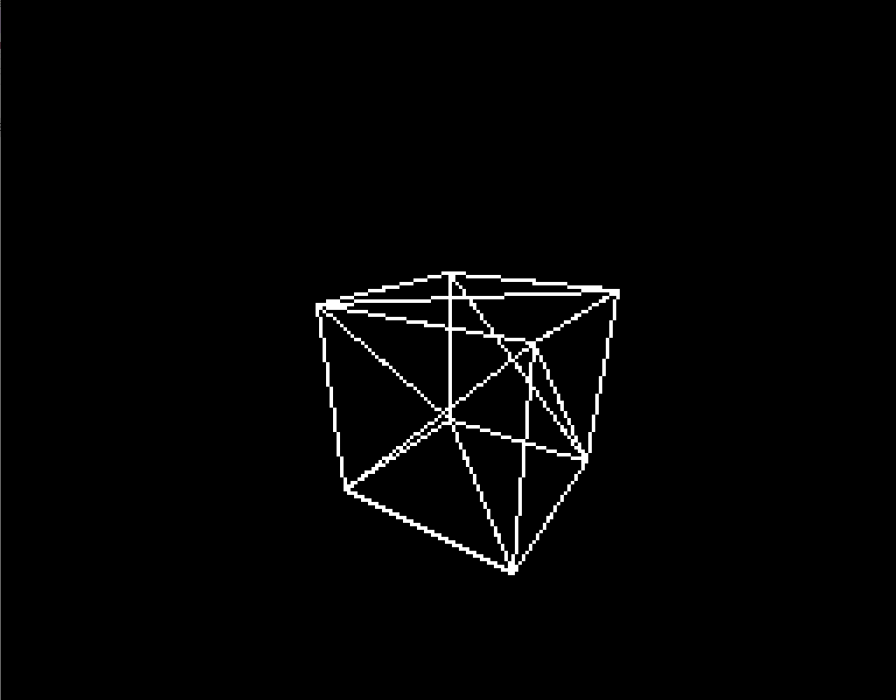
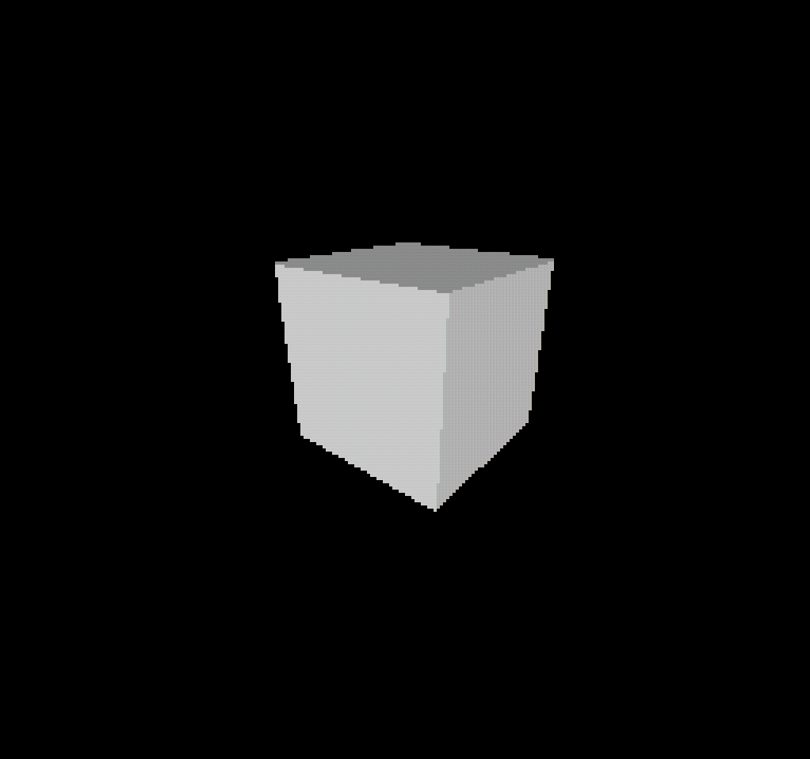
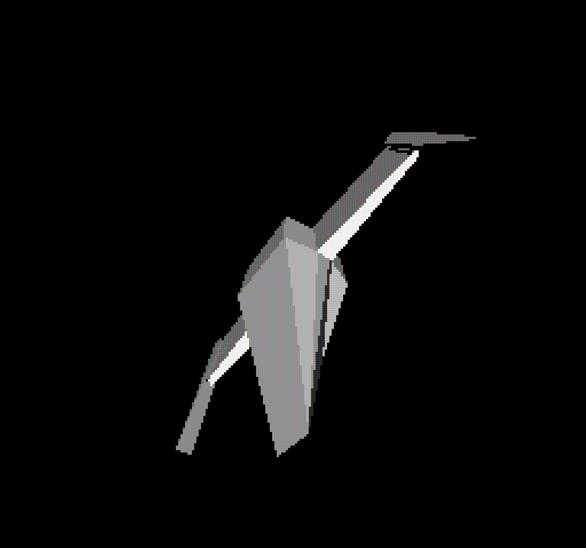
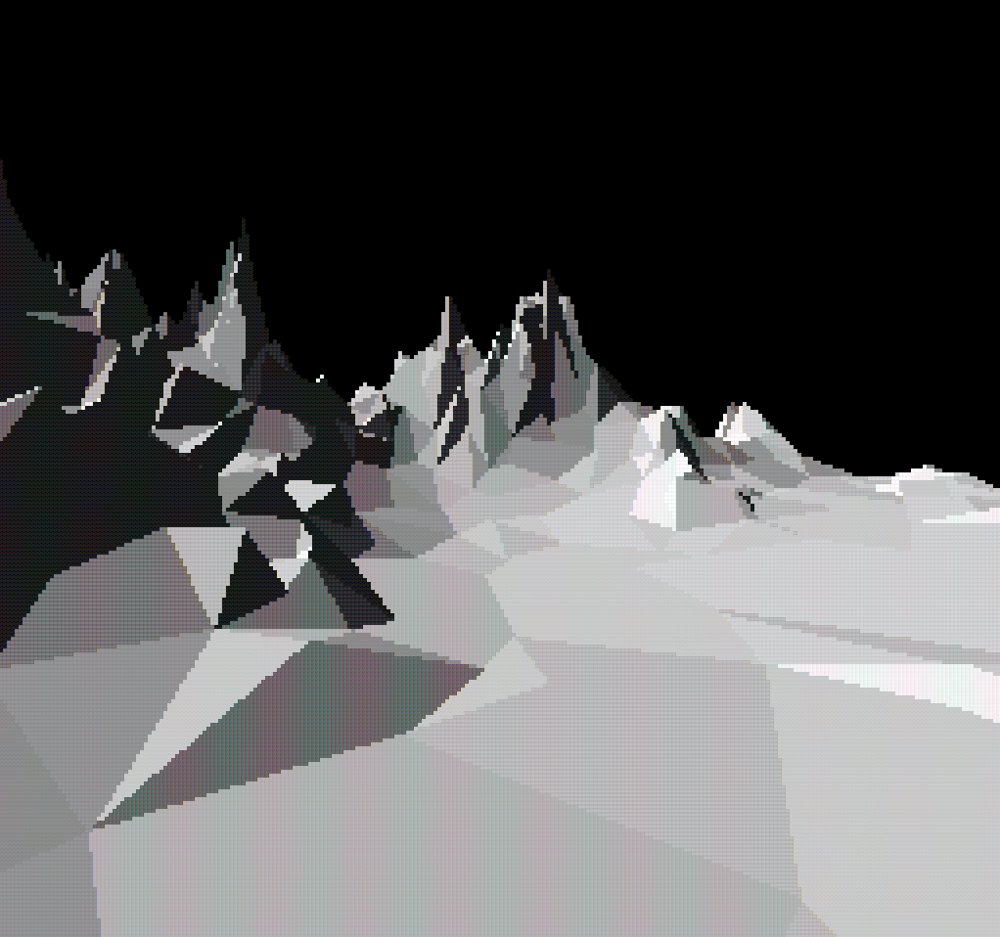
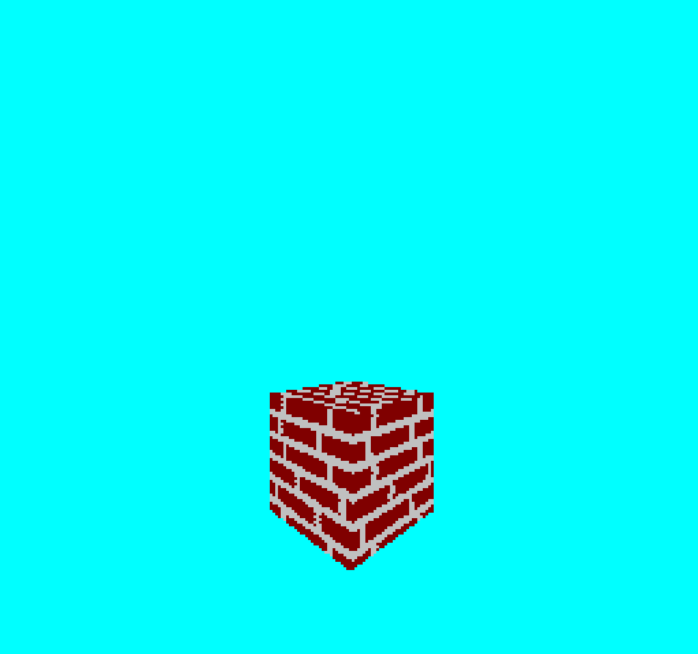

# Console 3D Engine

This project is my version of the Console 3D Engine by javidx9 (all credits to him), with various improvements and small changes. I followed his series and attempted to create the same thing with my own, slightly improved version of the `ConsoleGameEngine.h`. Here are the results!

#### Part 1: Projection

#### Part 2: Lighting

#### Part 3: Meshes

#### Part 4: Camera, Movement and Clipping

#### Part 5: Texture Mapping
